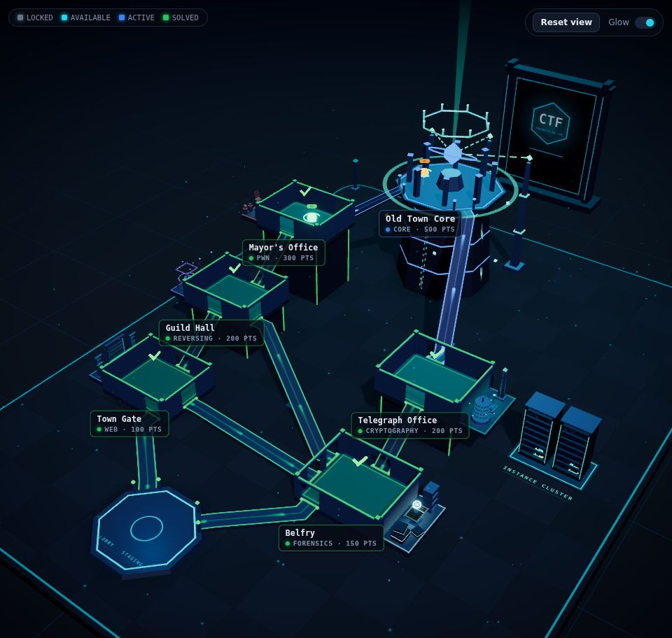
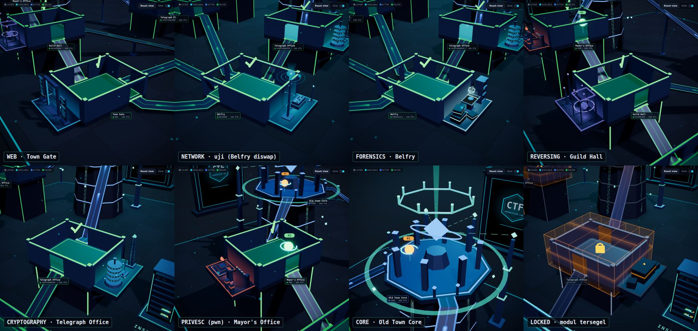
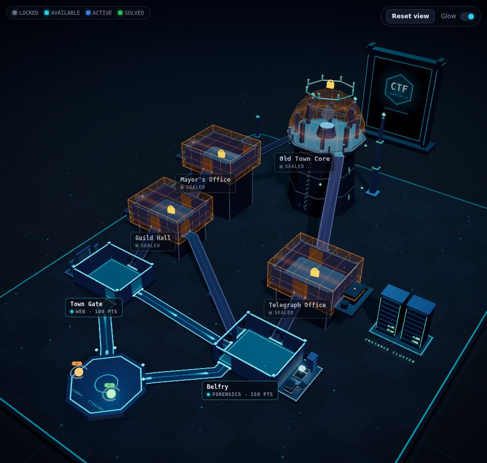

# Dekorasi Room per Kategori

Lanjutan dari [`visual-audit.md`](visual-audit.md). Fokus: identitas visual tiap kategori room lewat props statis + animasi, tanpa mengganggu tracking.

## 1. Audit singkat

| Temuan | Dampak |
| --- | --- |
| Lima room standar memakai modul identik (slab, dinding, pilar). Pembeda hanya warna status dan label. | Room Web dan Crypto tidak bisa dibedakan tanpa membaca label. |
| Sekeliling room kosong: tidak ada platform samping, props, atau "cerita" lingkungan. | Scene terasa seperti diagram, bukan fasilitas. |
| Ujung corridor berhenti di tepi slab tanpa sambungan; pintu hanya dua kusen. | Jalur terasa "ditempel", bukan masuk ke soket room. |
| Core hanya punya menara + kristal; tidak ada struktur pendukung di sekitarnya. | Objective akhir kurang monumental dibanding perannya. |
| Tidak ada branding institusi. | Kurang resmi untuk presentasi ke stakeholder. |

**Batasan arsitektur yang harus dihormati**

1. **Kategori room LOCKED tidak dikirim backend** (`lockedRoomFields`, diuji di `lab.test.js`). Frontend tidak boleh "menebak" kategori room terkunci. Solusi: room LOCKED menampilkan **modul tersegel** netral; props kategori **ter-deploy** (naik dari platform) saat room terbuka. Ini menjadi momen visual saat unlock, sekaligus menjaga keamanan.
2. **Map Old Town tidak punya room `network`**, dan Mayor's Office berkategori `pwn`. Tema `pwn` dipetakan ke gaya **Privilege Escalation** (brankas walikota = ruang akses terbatas). Dekorasi Network tetap dibuat dan otomatis dipakai saat map punya kategori `network`.

**Area yang bisa diberi ornament** (dihitung otomatis dari port):

| Room | Sisi dengan port | Sisi bebas → annex |
| --- | --- | --- |
| Town Gate (web) | N, E, S | W |
| Belfry (forensics) | N, W, S | E |
| Guild Hall (reversing) | N, E, S | W |
| Telegraph Office (crypto) | N, S | E |
| Mayor's Office (pwn → privesc) | N, S | W (E terlalu dekat corridor ke core) |
| Old Town Core | 45°, 135° | busur belakang 180°–360° |

## 2. Aturan placement

- **Annex**: platform samping (1 m) di sisi tanpa port, tidak bersinggungan dengan corridor, node lain, atau instance cluster. Room elevated mendapat bracing ke plinth, jadi tidak melayang.
- Area tengah room tetap milik tracking point; props hanya di annex dan perimeter.
- Urutan sisi: E → W → N → S. E didahulukan karena menghadap kamera utama; S terakhir karena label menggantung di sana. Fly-to kamera menyesuaikan sisi annex.
- Props ≤ 2,1 m di atas lantai room. Pada sudut kamera utama (elevasi 36°) props setinggi ini tidak menutupi interior room.
- Semua bagian statis di-merge (1 draw call hull + 1 accent); hanya bagian bergerak yang berupa mesh terpisah, dan tidak membuat shadow.
- Intensitas dan kecepatan animasi mengikuti status: AVAILABLE normal, ACTIVE paling hidup, SOLVED tenang. Hierarchy status tetap dibawa trim, lantai, dan field.

## 3. Rencana per kategori

| Kategori | Accent | Statis | Animasi |
| --- | --- | --- | --- |
| **Web** | cyan-blue `#38bdf8` | Portal arch gateway, dua screen pillar dengan chrome browser, jalur akses di lantai | UI panel scroll, scan bar naik-turun, garis data mengalir di portal, paket akses masuk ke room |
| **Network** | electric cyan `#22d3ee` | Tiang antena lattice, switch stack, relay pylon, cable conduit | Kepala antena berputar + sapuan sinyal, gelombang ring, paket bergerak di kabel, LED berkedip |
| **Forensics** | cool teal-white `#a5f3fc` | Tumpukan evidence crate + tape, meja scan, rak arsip berisi media | Sapuan scanner di meja, platter berputar, hologram barang bukti, pita evidence berdenyut, LED rak |
| **Reversing** | blue-violet `#8b8cf8` | Tiga pilar shard, sangkar analysis chamber | Kubus yang terurai lalu menyatu kembali, shard mengorbit, ring segmen yang membuka |
| **Cryptography** | cyan-green `#2dd4bf` | Rotor cipher (spindle + disk bertanda glyph), obelisk ter-enkode, perangkat telegraf | Disk berputar bertahap seperti kunci kombinasi, glyph obelisk bergulir, lampu Morse "CTF" + tuas telegraf, partikel kode mengorbit |
| **Privilege Esc.** | amber-red `#f0714f` | Dais bertingkat, kiosk akses, bollard hazard, palang checkpoint | Tingkat dais menyala berurutan (eskalasi), beam otorisasi, beacon peringatan berputar, palang naik-turun, lampu izin (denied/pending/granted mengikuti status) |
| **Core** | premium teal `#5eead4` | Tiga security pylon di busur belakang, crown ring di atas core | Crown berputar, arus energi naik di sisi menara, link energi pylon→core, fragmen mengorbit, beam vertikal saat ACTIVE/breached |

**Sambungan jalur**: lintel + lampu gerbang di setiap opening, junction node di keempat sudut ujung deck (warnanya mengikuti state jalur), dan gate post pada port oktagon (core & lobby).

**Logo institusi**: monolith backdrop di tengah-belakang arena (sumbu tengah room map, 5 m di belakang tepi deck), sejajar tepi deck. Logo tidak emissive, diredupkan, dan terkena fog, jadi tetap di bawah room map dalam hierarchy visual. Dari kamera utama (azimuth 36°) monolith tampak di kanan-atas, sengaja tidak tepat di belakang core supaya tidak bertumpuk dengan crown dan beam.

Logo **tidak disimpan di repo** (repo publik). Taruh satu file `.png`/`.webp`/`.svg` di `apps/frontend/src/assets/branding/` (di-gitignore); aspect ratio dibaca dari gambarnya. Tanpa file itu backdrop memakai emblem netral "CTF Progression Lab", seperti di screenshot di bawah. `VITE_BRANDING=neutral` memaksa emblem netral walau file logo ada, dan nama maupun isi file logo tidak ikut ter-bundle.

## 4. Hasil

- Tiap kategori punya siluet sendiri, jadi Web, Crypto, dan Reversing bisa dibedakan tanpa membaca label.
- Room LOCKED menampilkan modul tersegel; saat unlock, props kategori naik dari platform (diuji dengan Auto Demo, tanpa error console).
- Dekorasi Network diuji dengan mengganti kategori Belfry sementara, lalu map dikembalikan.
- Label, tracking point, dan corridor tidak tertutup props di home view maupun fly-to room.
