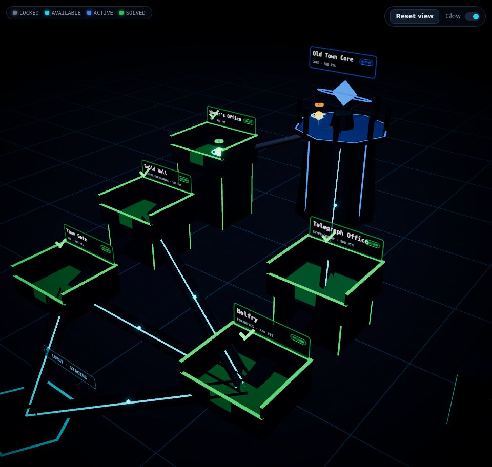
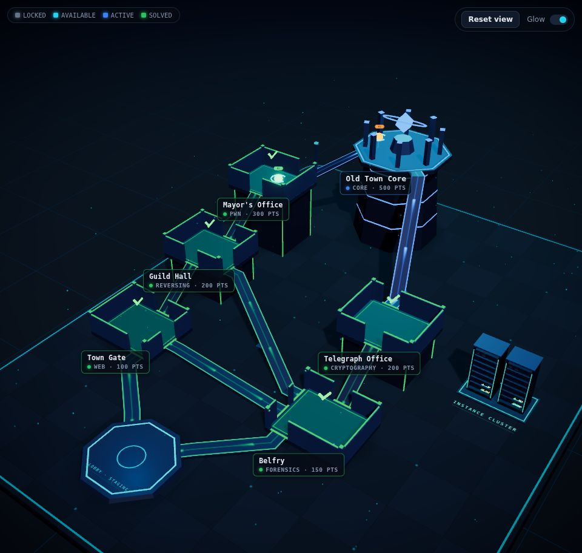
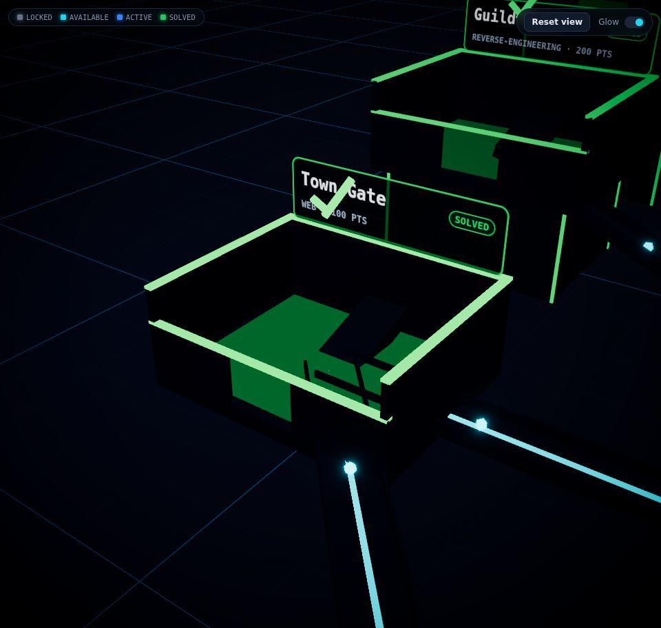
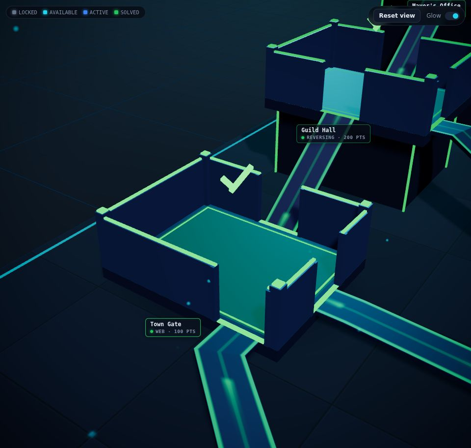
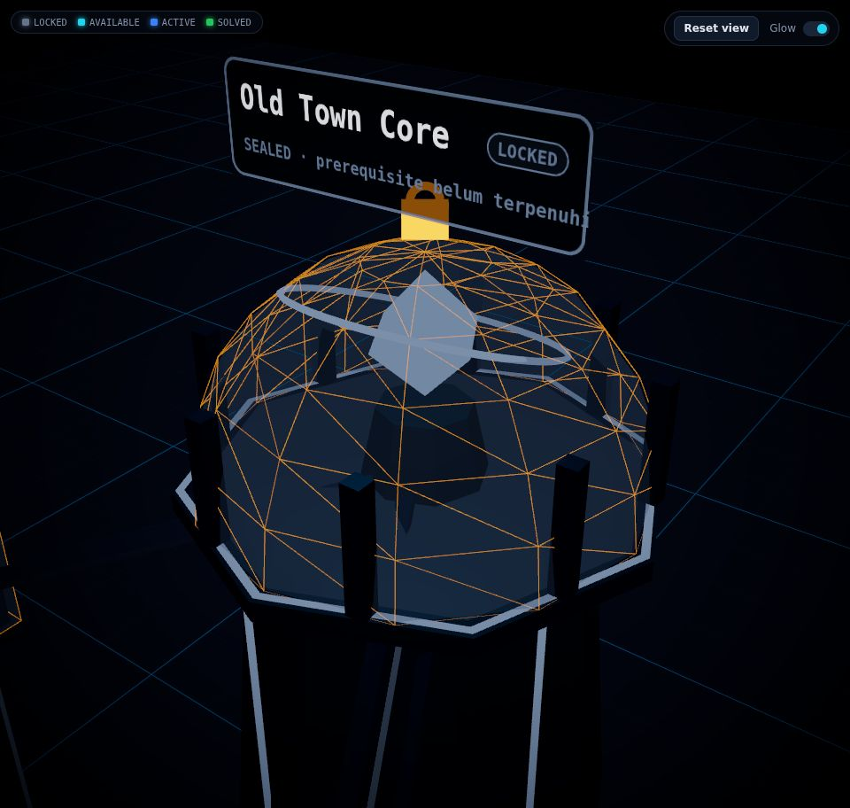
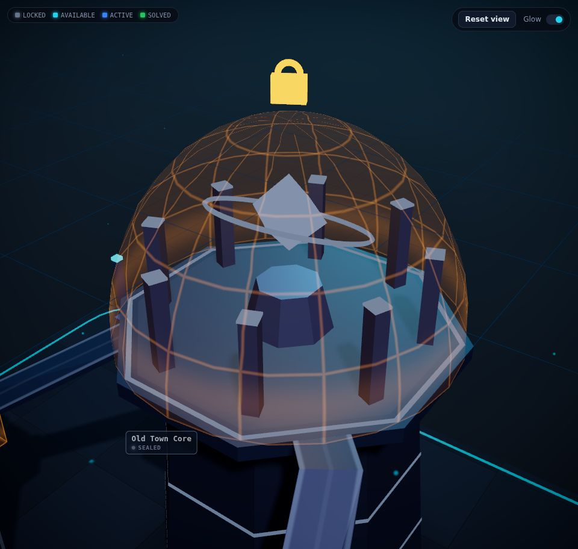

# Audit Visual & Teknis · 3D Team Battle View

Scope: `apps/frontend/src/components/scene/*` (FacilityCanvas, Facility, RoomModule, TrackingPoints, FxLayer, CameraRig, Effects, ServerRack, labels, markers) dengan map `old-town.json`. Audit memakai screenshot headless Chromium (1600×1000, stage 960×912) dan pengukuran geometri dari data map.

Screenshot sebelum/sesudah ada di `docs/visual-audit/`.

## 1. Temuan utama

1. **Corridor ditarik dari titik tengah room ke titik tengah room.** Bridge menembus lantai, dinding, dan plinth. Hasil pengukuran: 6 dari 9 corridor menembus dinding room, 4 menembus plinth room tujuan, dan semua ramp terlihat sebagai papan gelap miring di dalam interior room.
2. **Material gelap + metalness tanpa environment map.** Warna albedo `#0a111e` sampai `#1c2a42` dengan metalness 0,4 sampai 0,7 tidak punya apa pun untuk dipantulkan, jadi seluruh hull tampil hitam pekat. Bentuk room hanya terbaca dari garis neon.
3. **Lighting flat.** Hemisphere 1,0 + ambient 0,25 menerangi semua sisi sama rata. Directional tunggal tanpa shadow, dua point light terlalu lemah (intensitas 40, decay 2, jarak ±10 m). Tidak ada key/rim yang memisahkan objek dari background.
4. **Komposisi kamera meleset.** Target home view di-hardcode `(0, 1.8, -1.2)`. Lobby, tempat semua player mulai, terpotong di pojok kiri bawah, dan instance cluster ada di luar frame.
5. **Core menembus kubahnya sendiri.** Kubah radius 2,116, sisi luar pilar 2,140, titik tertinggi ring 2,274. Gembok core menabrak label.
6. **Label 3D sulit dibaca.** Papan nama menempel di dinding belakang dan menghadap +Z, sehingga terlihat miring dari kamera utama. Ikon centang/gembok menabrak label, dan bagian bawah label masuk 2,5 cm ke dalam dinding.

## 2. Masalah prioritas tinggi

| Issue | Why it is a problem | Proposed fix | Priority | Estimated impact |
| --- | --- | --- | --- | --- |
| Corridor center-to-center menembus dinding, plinth, dan interior | Kesan murahan dan salah secara fisik; ramp terlihat di dalam room | Hitung **port** di tepi room (sisi yang menghadap room tujuan), buat opening di dinding pada port, dan bangun deck dari port ke port dengan geometri custom agar ujungnya pas di tepi slab | Tinggi | Sangat tinggi: semua clipping corridor hilang |
| Tracking point bergerak lurus antar pusat room | Player terlihat menembus dinding saat pindah room | Waypoint mengikuti port corridor: slot → port asal → port tujuan → slot | Tinggi | Tinggi: gerakan terlihat "berjalan di jalur" |
| Hull hitam, metalness tanpa env map | Tidak ada bentuk, volume, atau kesan material | Environment map ringan dari `Lightformer` (dirender sekali), warna hull dinaikkan ke slate-blue, roughness/metalness dikalibrasi, `flatShading` untuk faceting low-poly | Tinggi | Sangat tinggi: room punya volume dan pantulan cyber |
| Lighting flat tanpa hierarchy | Scene datar, tidak ada fokus | Skema 4 lampu: key dingin dengan shadow, fill hemisphere rendah, rim teal dari belakang, accent di core. Hapus ambient | Tinggi | Tinggi |
| Tidak ada shadow/grounding | Room elevated terasa melayang | Directional shadow yang **di-bake** (render ulang hanya saat layout/status berubah) + blob AO murah di kaki plinth | Tinggi | Tinggi, biaya per frame nol |
| Kamera home hardcode, lobby terpotong | Player di lobby tidak terlihat saat membuka tim | Home view dihitung dari bounds map (room, lobby, cluster) dan aspect stage | Tinggi | Tinggi |
| Core: pilar & ring menembus kubah | Clipping paling mencolok di focal point | Kubah diperbesar di luar pilar, ring & kristal dikecilkan, pilar di vertex oktagon, port corridor di tengah sisi datar | Tinggi | Tinggi |

## 3. Masalah prioritas menengah

| Issue | Why it is a problem | Proposed fix | Priority | Estimated impact |
| --- | --- | --- | --- | --- |
| Garis corridor hanya punya 2 state (open/closed) | Tidak ada hierarchy locked/available/active/solved | State corridor diturunkan dari status kedua ujung; shader flow dengan warna, kecepatan, dan intensitas per state; sweep sekali saat unlock | Menengah | Tinggi |
| Paket data berupa 2 icosahedron per corridor | Kaku, tidak terbaca sebagai aliran | Shader strip: edge line + dash "komet" bergerak searah progression | Menengah | Menengah-tinggi |
| Pintu geser coplanar dengan dinding depan | Z-fighting (front face & top face di z/y yang sama) saat pintu terbuka | Pintu diganti **shutter** yang turun (scale Y) di dalam opening; tidak masuk ke dinding | Menengah | Menengah |
| Tiang trim plinth tepat di sudut plinth | Setengah tertanam di plinth | Strip sudut flush di luar plinth | Menengah | Rendah-menengah |
| Tiang trim core lurus pada plinth meruncing | Bagian bawah tertanam, atas melayang | Diganti band cahaya horizontal yang mengikuti taper | Menengah | Menengah |
| Lingkungan kosong: plane 80×80 + grid | Tidak terasa fasilitas; tepi plane terlihat | Deck fasilitas (rounded, trim, pola panel) dari bounds map, backdrop gradient, fog linear yang benar-benar menyentuh scene | Menengah | Tinggi |
| Fog mulai di 38 m | Room terjauh sekitar 30 m dari kamera, jadi fog tidak berefek | Fog 26–78 m dengan warna horizon | Menengah | Menengah |
| Label canvas miring, bertabrakan ikon | Readability rendah, tekstur dibuat ulang tiap ganti status | Label HTML ringan (chip) di depan tiap room, bisa diklik, dim untuk LOCKED | Menengah | Tinggi |
| Force field LOCKED abu-abu polos | Terlihat seperti kotak plastik | Shader grid amber tipis dengan scan band, membungkus seluruh modul | Menengah | Menengah |
| Instance cluster hardcode `(10.5, 0, 1.5)` | Tidak ikut map lain; di luar frame | Posisi dari bounds map + pad dasar | Menengah | Rendah-menengah |

## 4. Quick wins

- Hapus `ambientLight`, turunkan hemisphere ke fill rendah, tambah rim light. Efek besar, 3 baris.
- Naikkan albedo hull ke `#1b2840`–`#26354f` dan pasang env map. Room langsung punya volume.
- Fog near/far dikalibrasi ke jarak kamera.
- Vignette `darkness 0.7` diturunkan ke 0,45 supaya pojok stage tidak mati.
- Kubah core diperbesar 10 cm di luar pilar.
- `InstanceLink` dan pulse corridor membuat `Vector3`/`Color` baru tiap render; di-memo.

## 5. Visual direction

**Cyber operations map**: fasilitas gelap di atas deck, hull slate-blue dengan pantulan halus, neon hanya pada pembawa informasi (status, jalur, player).

| Token | Hex | Peran |
| --- | --- | --- |
| Void | `#03060c` → `#0a1526` | Backdrop gradient & fog horizon |
| Deck | `#0d1522` | Lantai fasilitas, panel seam `#16223a` |
| Hull | `#1f2c45` | Dinding, pilar |
| Slab | `#141f33` | Lantai room, plinth |
| Cyan `#22d3ee` | AVAILABLE, jalur terbuka |
| Blue `#3b82f6` | ACTIVE (ada player) |
| Green `#22c55e` | SOLVED |
| Amber `#f59e0b` | LOCKED / sealed |

Hierarchy visual (dari paling menonjol): **Core** (paling tinggi, accent light, kristal) → **ACTIVE** (biru berdenyut + scan ring + flow cepat) → **AVAILABLE** (cyan stabil) → **SOLVED** (hijau tenang) → **LOCKED** (redup, field amber tipis). Player marker selalu paling terang di room-nya.

## 6. Rekomendasi teknis

- **Satu sumber layout** (`scene/layout.js`): port, corridor, bounds, cluster dihitung sekali dari snapshot (memo berdasarkan posisi, bukan status). Dipakai Facility, TrackingPoints, CameraRig, deck.
- **Material bersama** (`scene/materials.js`): hull/slab/plinth/deck dibuat sekali. Material per-room hanya untuk yang berubah warna per status.
- **Shader corridor** (`scene/lines/flowMaterial.js`): UV.x dalam satuan meter supaya kepadatan dash sama di semua panjang; satu uniform waktu bersama.
- **Shadow bake**: `shadowMap.autoUpdate = false`, di-update beberapa frame saat mount dan saat status berubah.
- **Env map**: `<Environment frames={1} resolution={256}>` berisi Lightformer. Tanpa file HDR, jadi tetap jalan di hosting statis dengan CSP ketat.
- **Label**: satu layer DOM di atas canvas; posisi diproyeksikan tiap frame oleh `LabelProjector` langsung ke `style.transform`. (drei `Html` sempat dicoba, tapi membuat React root per label dan label pertama kehilangan isinya karena race unmount antar-root.)
- **Opsional/mahal** (tidak diaktifkan): SSAO, shadow real-time per frame, volumetric light.

## 7. Komponen/file yang diubah

Semua path relatif ke `apps/frontend/src/`.

| File | Perubahan |
| --- | --- |
| `config/scene.js` (baru) | Lighting, atmosphere, kamera, post-processing dalam satu tempat |
| `config/theme.js` | Token `SURFACE` untuk material 3D |
| `components/scene/layout.js` (baru) | Dimensi modul, port di tepi room/core/lobby, jalur port-ke-port (stub bila landai), pylon, bounds, posisi cluster |
| `components/scene/geometry.js` (baru) | Merge box statis, bingkai lantai, builder deck corridor (ujung rata tepi room, miter di sambungan) |
| `components/scene/materials.js` (baru) | Material permukaan bersama + helper glow |
| `components/scene/lighting/SceneLighting.jsx` (baru) | Hemisphere, key + shadow, rim, accent core/lobby, `ShadowBaker` |
| `components/scene/environment/` (baru) | `Backdrop`, `EnvironmentMap`, `FacilityDeck` (+ beacon sudut, blob kontak), `Particles`, `Lobby`, `InstanceCluster`, `textures` |
| `components/scene/lines/` (baru) | `Corridors` (deck, overlay, pylon, state), `flowMaterial` (shader) |
| `components/scene/fx/shieldMaterial.js` (baru) | Shader force field LOCKED |
| `components/scene/RoomLabels.jsx` (baru) | Layer label DOM + `LabelProjector` |
| `components/scene/RoomModule.jsx` | Dinding bersegmen + opening per port, pilar sudut, shutter, core tanpa clipping, geometri statis di-merge |
| `components/scene/Facility.jsx`, `FacilityCanvas.jsx` | Susunan scene baru, layout di-memo per map |
| `components/scene/TrackingPoints.jsx`, `markers.js` | Rute lewat port & deck corridor |
| `components/scene/CameraRig.jsx` | Home view dari bounds + aspect |
| `components/scene/Effects.jsx` | Nilai dari config, vignette lebih ringan |
| `components/scene/ServerRack.jsx` | Material bersama, shadow |
| `components/scene/labels.js`, `FxLayer.jsx`, `styles.css` | Label canvas lama dihapus, import konstanta, style chip + z-index overlay |

## 8. Hasil implementasi

| | Sebelum | Sesudah |
| --- | --- | --- |
| Home view |  |  |
| Town Gate |  |  |
| Core (LOCKED) |  |  |

**Terverifikasi**

- Polyline semua corridor diuji terhadap volume setiap node (oktagon diuji per sisi datar): **0 corridor menembus room, core, atau lobby** (sebelumnya 6 menembus dinding, 4 menembus plinth).
- Core: pilar, ring, dan kristal berada di dalam kubah (uji ellipsoid ≤ 0,92).
- Auto Demo dari reset sampai CORE BREACHED berjalan tanpa error console; player bergerak lewat pintu dan deck.
- Mode Glow OFF (tanpa post-processing) menampilkan warna yang sama karena semua shader memakai `colorspace_fragment`.
- Test backend & engine: 28/28 lulus.

**Biaya render**

- Geometri statis per room digabung (hull, trim), jadi draw call per room turun meski detail bertambah.
- Shadow map 2048 hanya dirender ±90 frame saat mount atau saat status berubah.
- Environment map dirender sekali; partikel 1 draw call dengan animasi di GPU.
- Post-processing tetap tiga efek (bloom, vignette, tone mapping).

**Belum dikerjakan / opsional**

- Tangga untuk ramp curam (saat ini ramp 31–36° untuk beda stage 1,4 m dengan celah 1,9 m). Alternatif: perbesar jarak antar stage di map JSON.
- SSAO, shadow real-time, volumetric light: sengaja tidak dipakai demi performa.
- Warning `THREE.Clock deprecated` berasal dari R3F/drei versi saat ini, bukan kode scene.
