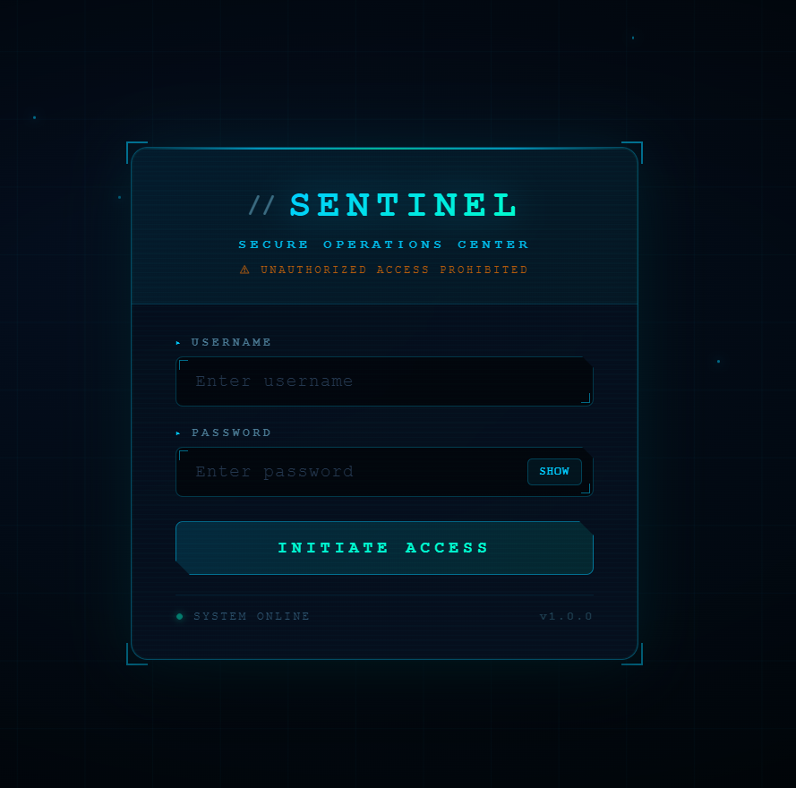
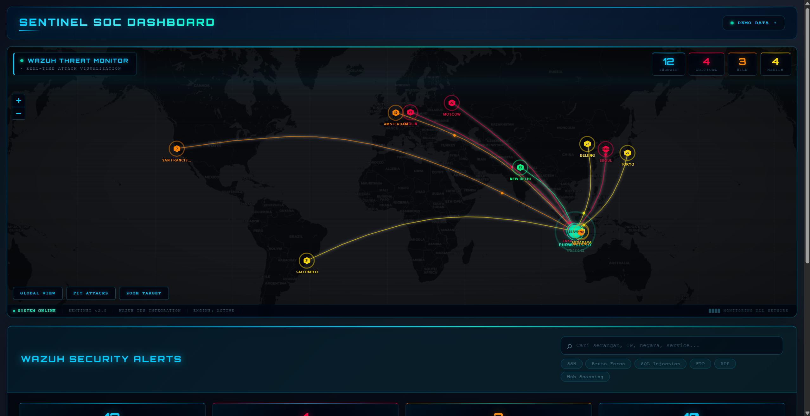
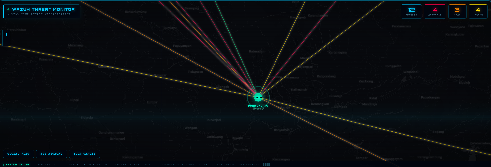
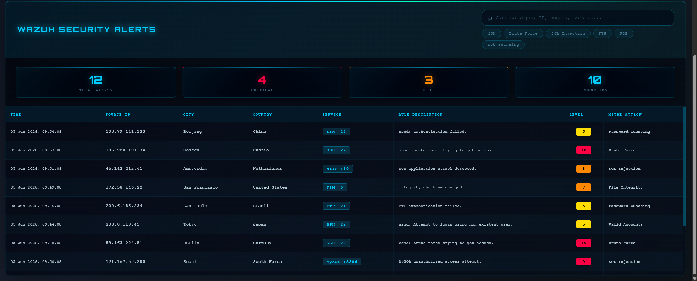

<div align="center">

# 🛡️ Project SENTINEL

**Security Event and Network Threat Intelligence with Notification, Evidence and Live-map**

[](https://react.dev)
[](https://nodejs.org)
[](https://wazuh.com)
[](https://leafletjs.com)
[](LICENSE)

*A cyberpunk-themed threat visualization dashboard that displays live attack data on an interactive world map, powered by Wazuh IDS alerts.*

</div>

---

## 📸 Screenshots

### 🔐 Login Screen


> Secure JWT authentication with animated particle background and cyberpunk styling.

---

### 🗺️ Live Attack Map: Full Dashboard


> Real-time world map showing attack arcs from 12 countries converging on the target server. Color-coded by severity: 🔴 Critical · 🟠 High · 🟡 Medium.

---

### 🎯 Target Server Close-up


> Zoomed view of the defended server node with all inbound attack vectors: SSH brute force, SQL Injection, RDP, MySQL attacks.

---

### 📋 Security Alerts Table


> Searchable alert log with GeoIP enrichment, MITRE ATT&CK tags, service classification, and severity badges.

---

## ✨ Features

| Feature | Description |
|---------|-------------|
| 🗺️ **Live Attack Map** | Interactive Leaflet.js world map with animated arc trajectories and traveling pulse dots |
| 📡 **Wazuh Integration** | Direct connection to Wazuh Manager API & OpenSearch Indexer (last 24h alerts) |
| 🌍 **GeoIP Enrichment** | Automatic IP geolocation via `ip-api.com` for all external source IPs |
| ⚡ **Severity HUD** | Real-time counters for Threats / Critical / High / Medium with glowing neon indicators |
| 🔍 **Smart Search** | Full-text search with auto-complete across IP, country, service, MITRE technique |
| 🎭 **Demo Mode** | 12 built-in global attack scenarios, no Wazuh needed to try it |
| 🔐 **JWT Auth** | Secure login with bcrypt password hashing and token expiry |
| 🎨 **Cyberpunk UI** | Orbitron font · Scanline overlay · Animated scan beam · Glassmorphism HUD |
| 📊 **MITRE ATT&CK** | Every alert tagged with relevant technique (Brute Force, SQL Injection, etc.) |

---

## 🏗️ Tech Stack

```
┌─────────────────────────────────────────────────────────┐
│                  PROJECT SENTINEL                        │
│                                                         │
│  Frontend                    Backend                    │
│  ─────────────────           ────────────────────       │
│  React 19                    Node.js + Express 5        │
│  Leaflet.js (maps)           JWT Authentication         │
│  Orbitron (Google Fonts)     bcrypt password hashing    │
│  CSS3 Animations             ip-api.com (GeoIP)         │
│                                                         │
│  SIEM Integration                                       │
│  ────────────────────────────────────────────────       │
│  Wazuh Manager API (REST)                               │
│  Wazuh Indexer / OpenSearch                             │
└─────────────────────────────────────────────────────────┘
```

---

## 📁 Project Structure

```
sentinel-soc-dashboard/
│
├── backend/
│   ├── server.js              # API routes: alert fetch, GeoIP, demo data
│   ├── auth.js                # JWT middleware & login/logout routes
│   ├── scripts/
│   │   └── generateHash.js    # Utility to bcrypt-hash admin password
│   ├── package.json
│   └── .env.example           ← copy to .env and fill in credentials
│
├── frontend/
│   ├── public/
│   │   └── index.html         # Loads Orbitron font from Google Fonts
│   ├── src/
│   │   ├── App.js             # Root: auth check, data fetch, layout
│   │   ├── App.css            # Header, menu, global styles
│   │   ├── components/
│   │   │   ├── Map2D.js       # Leaflet map + arc animations + HUD
│   │   │   ├── Map2D.css      # Scanlines, scan beam, glassmorphism HUD
│   │   │   ├── AlertsTable.js # Searchable table with MITRE tags
│   │   │   ├── AlertsTable.css
│   │   │   ├── Login.js       # Animated login page
│   │   │   └── Login.css
│   │   └── utils/
│   │       └── auth.js        # Token helpers
│   └── package.json
│
└── docs/screenshots/          # README preview images
```

---

## 🚀 Quick Start

### Prerequisites
- Node.js 18+
- Wazuh 4.x *(optional, demo mode works without it)*

### 1. Clone & Install

```bash
git clone https://github.com/rahardjo-glenvio/cybersecurity-portfolio.git
cd cybersecurity-portfolio/tools/sentinel-soc-dashboard

npm install --prefix backend
npm install --prefix frontend
```

### 2. Configure Environment

```bash
cp backend/.env.example backend/.env
# Edit backend/.env with your credentials
```

Generate admin password hash:
```bash
node backend/scripts/generateHash.js
# Paste the output hash into .env as ADMIN_PASSWORD_HASH
```

### 3. Run

```bash
# Terminal 1: Backend API (port 3001)
cd backend && node server.js

# Terminal 2: Frontend dev server (port 3000)
cd frontend && npm start
```

Open `http://localhost:3000` and login with your admin credentials.

---

## 🔌 API Reference

| Method | Endpoint | Auth | Description |
|--------|----------|:----:|-------------|
| `POST` | `/api/auth/login` | ❌ | Login → returns JWT token |
| `POST` | `/api/auth/logout` | ✅ | Invalidate session token |
| `GET` | `/api/alerts` | ✅ | Live alerts from Wazuh Indexer (last 24h) |
| `GET` | `/api/alerts/demo` | ✅ | 12 static demo attacks from global IPs |
| `GET` | `/api/test` | ✅ | Backend health check |

---

## 🎮 Demo Mode

No Wazuh? No problem. Switch to **Demo Mode** using the top-right dropdown, no setup needed.

Includes 12 pre-configured global attack scenarios:

| Source IP | Country | Attack Type | Service | Severity |
|-----------|---------|-------------|---------|----------|
| 103.79.141.133 | 🇨🇳 China | Password Guessing | SSH :22 | Medium |
| 185.220.101.34 | 🇷🇺 Russia | Brute Force | SSH :22 | **Critical** |
| 45.142.212.61 | 🇳🇱 Netherlands | SQL Injection | HTTP :80 | High |
| 89.163.224.51 | 🇩🇪 Germany | Brute Force | SSH :22 | **Critical** |
| 121.167.58.200 | 🇰🇷 South Korea | SQL Injection | MySQL :3306 | **Critical** |
| 49.37.212.18 | 🇮🇳 India | Phishing | SMTP :25 | Medium |
| 203.0.113.45 | 🇯🇵 Japan | Valid Accounts | SSH :22 | Medium |
| 200.6.185.234 | 🇧🇷 Brazil | Password Guessing | FTP :21 | Medium |
| 172.58.146.22 | 🇺🇸 United States | File Integrity | FIM | High |
| 103.155.92.11 | 🇮🇩 Indonesia | Brute Force | RDP :3389 | High |
| 36.68.43.100 | 🇮🇩 Indonesia | Brute Force | SSH :22 | **Critical** |
| 114.142.171.22 | 🇮🇩 Indonesia | Web Scanning | HTTPS :443 | Medium |

---

## 🔒 Security Design

- ✅ All credentials via **environment variables**, nothing hardcoded in source
- ✅ JWT tokens with expiry + server-side invalidation on logout
- ✅ bcrypt password hashing (cost factor 12)
- ✅ Rate limiting via `express-rate-limit`
- ✅ Security headers via `helmet`
- ✅ CORS restricted to local network
- ⚠️ Wazuh HTTPS uses `rejectUnauthorized: false` (internal network use only)

---

## 🌐 Architecture

```
[Internet Attackers]
        │
        ▼
[Wazuh Agent] ──► [Wazuh Manager :55000]
                          │
                          ▼
                  [Wazuh Indexer / OpenSearch :9200]
                          │
                          ▼
                  [Sentinel Backend :3001]
                    ├── /api/auth
                    ├── /api/alerts      ◄── GeoIP enrichment
                    └── /api/alerts/demo
                          │
                          ▼
                  [Sentinel Frontend :3000]
                    ├── Attack Map (Leaflet)
                    ├── Severity HUD
                    └── Alerts Table
```

---

## 📄 License

MIT License, free to use, fork, and adapt for your own homelab.

---

<div align="center">

**Built with ☕ + 🔐 | Cybersecurity Homelab Project**

[⬆ Back to Portfolio](../../README.md)

</div>
